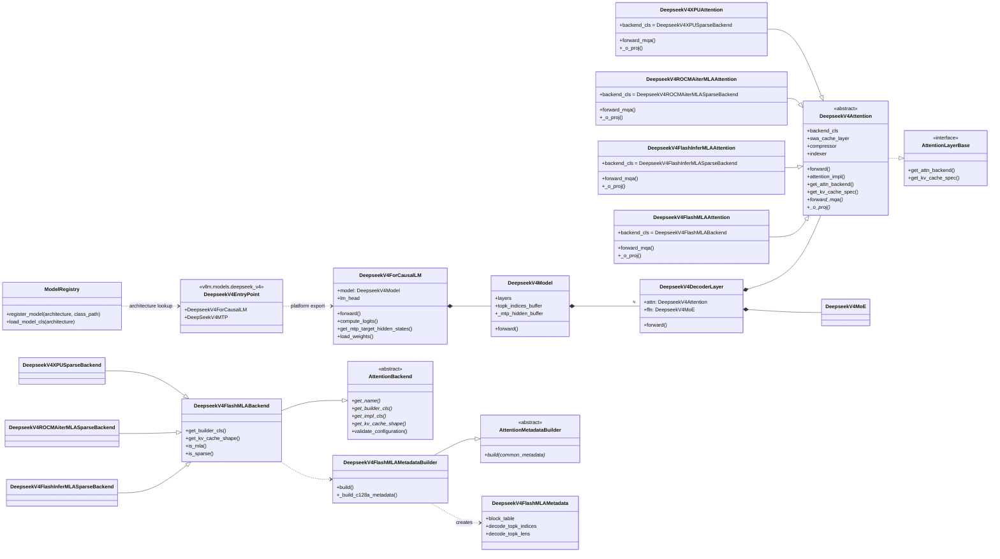
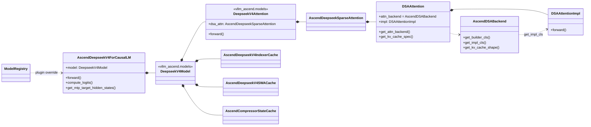
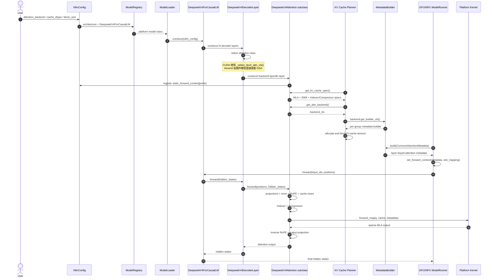
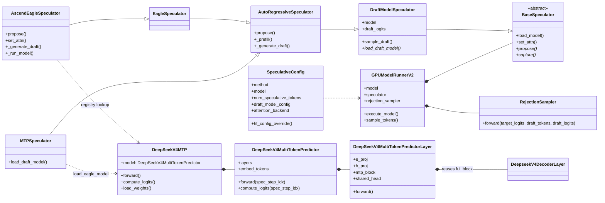
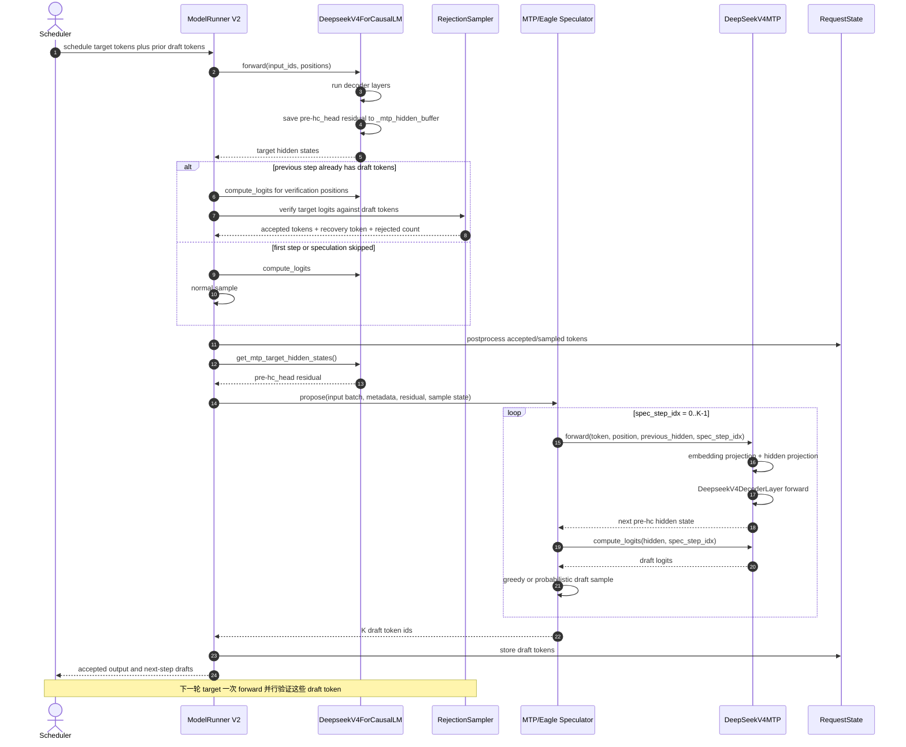
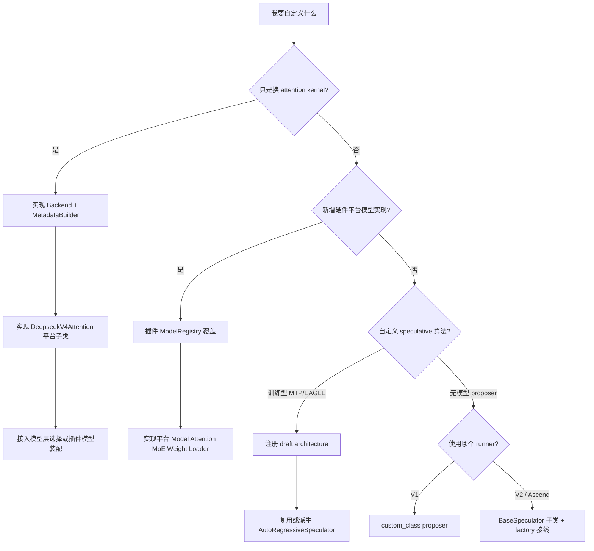

# DeepSeek V4 自定义 Backend 与 Spec Decode 架构图

本文基于以下两份当前工作区源码整理：

- vLLM：`E:\projects\GLM-Next\vllm`
- vLLM Ascend：当前仓库

这里的 “backend” 容易混淆，实际至少有三层：

1. **模型实现 backend**：同一个 `DeepseekV4ForCausalLM` 在 NVIDIA、ROCm、XPU、Ascend 上对应不同模型类。
2. **Attention backend**：定义 KV-cache 布局、metadata builder、kernel 能力以及 attention 执行。
3. **Compilation backend**：Inductor、eager 等编译后端，不是本文重点。

## 1. DeepSeek V4 模型与 Attention Backend 类图



### 关键解读

DeepSeek V4 是 **model-driven attention backend**：

- `DeepseekV4Attention.forward()` 自己完成 Q/KV 投影、RMSNorm、RoPE、cache insert、Indexer、Compressor。
- 平台子类通过 `forward_mqa()` 直接调用 FlashMLA、FlashInfer、AITER 或 XPU kernel。
- `DeepseekV4FlashMLABackend.get_impl_cls()` 故意不提供独立 `AttentionImpl`；backend 主要承担 metadata 和 KV-cache 契约。
- `_select_dsv4_attn_cls()` 根据 `attention_config.backend` 与设备 capability 选择的不是普通 `AttentionImpl`，而是整个 `DeepseekV4Attention` 子类。

因此，仅实现一个通用 `AttentionBackend` 并注册为 `CUSTOM`，**不足以**让 DeepSeek V4 使用它；还必须让 DeepSeek V4 的模型层选中与它配套的 `DeepseekV4Attention` 子类。

## 2. Ascend 插件覆盖关系



Ascend 当前没有走上游 `vllm.models.deepseek_v4.__init__` 的硬件分支，而是通过：

```text
ModelRegistry.register_model(
    "DeepseekV4ForCausalLM",
    "vllm_ascend.models.deepseek_v4:AscendDeepseekV4ForCausalLM",
)
```

覆盖模型入口。这个方式比修改上游 `deepseek_v4/__init__.py` 更符合硬件插件边界。

## 3. Backend 初始化与单次 Forward 时序图



### 自定义 Attention Backend 的最小闭环

| 层次 | 必须实现或修改 | DeepSeek V4 特别要求 |
|---|---|---|
| Backend 契约 | `AttentionBackend` 子类 | 校验 dtype、head size、block size、capability；定义 KV shape |
| Metadata | `AttentionMetadata` 与 `AttentionMetadataBuilder` | 同时覆盖 prefill、decode、MTP 的 `query_len > 1` |
| 模型 attention | `DeepseekV4Attention` 平台子类 | 实现 `forward_mqa()`、`_o_proj()`、head padding 和 `backend_cls` |
| 选择逻辑 | `_select_dsv4_attn_cls()` 或插件模型装配 | 只注册 `AttentionBackendEnum.CUSTOM` 不会自动进入 DeepSeek V4 |
| KV-cache | `get_kv_cache_spec()` 与 backend `get_kv_cache_shape()` | MLA、SWA、Indexer、Compressor 的 block/stride/dtype 必须一致 |
| 图执行 | static forward context、metadata 稳定地址 | 验证 eager、piecewise/full graph 及 dummy/profile |

Ascend 上推荐沿用当前插件模式：注册 Ascend 模型类，让模型内部装配 `AscendDSABackend` 和 `DSAAttentionImpl`，不要在上游 NVIDIA/ROCm/XPU 入口中追加 Ascend 分支。

## 4. Spec Decode / MTP 类图



DeepSeek V4 MTP 的 draft model 不是一个缩小版完整 LLM，而是 checkpoint 内的 MTP 层：

- `SpeculativeConfig.hf_config_override()` 把 `deepseek_v4` 改写成 `deepseek_mtp`。
- architecture 改写为 `DeepSeekV4MTPModel`，再由 Model Registry 加载 MTP 类。
- MTP layer 复用一个完整 `DeepseekV4DecoderLayer`，并额外包含 embedding projection、hidden projection 与 shared head。
- target model 在 forward 时把 **pre-hc_head residual** 写入 `_mtp_hidden_buffer`。
- runner 通过 `get_mtp_target_hidden_states()` 把这个特殊 hidden state 交给 drafter。
- `load_eagle_model()` 还会共享 embedding、LM head 与 `topk_indices_buffer`。

## 5. 一轮 MTP 推测解码时序图



## 6. 如何自定义 Spec

### 路线 A：自定义训练型 MTP/EAGLE（适合 DeepSeek V4）

优先复用 V2 的 `DraftModelSpeculator` / `AutoRegressiveSpeculator`：

1. 在 `SpeculativeConfig` 中识别 method，并生成 `draft_model_config`。
2. 为 draft architecture 注册模型类。
3. draft model 至少实现 `forward()`、`compute_logits()`、`load_weights()`；需要时实现独立 embedding/LM head。
4. 如果 target 交给 draft 的不是最终 hidden state，像 DeepSeek V4 一样提供显式 hook，例如 `get_mtp_target_hidden_states()`。
5. 若生成方式仍是逐 token 自回归，只需复用或继承 `MTPSpeculator`；如果 position、KV 更新、并行 drafting 或 tree layout 不同，再派生新的 speculator。
6. 在 `init_speculator()` 中注册 method 到 speculator 的映射。
7. Ascend 还要同步扩展 `vllm_ascend.worker.v2.spec_decode...init_speculator()`，并处理 NPU metadata 与 ACLGraph。

### 路线 B：无模型或任意算法 proposer

当前源码的 `method="custom_class"` 只完整接到了旧 V1 runner：

```text
constructor:
    MyProposer(vllm_config)

required method:
    propose(
        sampled_token_ids,
        num_tokens_no_spec,
        token_ids_cpu,
        slot_mappings=...,
    )
```

V2 的 `init_speculator()` 没有 `custom_class` 分支，而且要求的是更严格的 `BaseSpeculator` 生命周期：

- `propose()`
- `init_cudagraph_manager()`
- `capture()`
- draft model 场景还包括 `load_model()` 与 `set_attn()`

所以面向 DeepSeek V4 / Ascend V2 时，不应把 V1 `custom_class` 当成最终扩展接口。应实现一个 `BaseSpeculator` 子类，并同时接入：

```text
vllm/v1/worker/gpu/spec_decode/__init__.py
vllm_ascend/worker/v2/spec_decode/eagle/__init__.py
```

无论 proposer 如何产生 draft token，最终分布正确性仍由 target logits 和 `RejectionSampler` 保证；自定义 proposer 不应绕过 target verification。

## 7. 扩展点选择



## 8. 重点源码索引

### vLLM

- 模型注册：`vllm/model_executor/models/registry.py`
- 平台入口：`vllm/models/deepseek_v4/__init__.py`
- DeepSeek V4 attention 基类：`vllm/models/deepseek_v4/attention.py`
- CUDA attention 类选择：`vllm/models/deepseek_v4/nvidia/model.py`
- FlashMLA backend 与 metadata：`vllm/models/deepseek_v4/sparse_mla.py`
- FlashMLA 执行层：`vllm/models/deepseek_v4/nvidia/flashmla.py`
- FlashInfer 执行层：`vllm/models/deepseek_v4/nvidia/flashinfer_sparse.py`
- Attention backend 抽象：`vllm/v1/attention/backend.py`
- Backend registry：`vllm/v1/attention/backends/registry.py`
- Metadata 初始化：`vllm/v1/worker/gpu/attn_utils.py`
- Spec 配置与 DeepSeek V4 MTP config 改写：`vllm/config/speculative.py`
- V2 speculator factory：`vllm/v1/worker/gpu/spec_decode/__init__.py`
- V2 speculator 抽象：`vllm/v1/worker/gpu/spec_decode/speculator.py`
- 自回归 proposer：`vllm/v1/worker/gpu/spec_decode/autoregressive/speculator.py`
- MTP speculator：`vllm/v1/worker/gpu/spec_decode/mtp/speculator.py`
- DeepSeek V4 MTP model：`vllm/models/deepseek_v4/nvidia/mtp.py`
- Target/MTP 权重与 buffer 共享：`vllm/v1/worker/gpu/spec_decode/eagle/utils.py`
- V2 target forward、verification、propose 主链：`vllm/v1/worker/gpu/model_runner.py`
- V1 custom proposer：`vllm/v1/spec_decode/custom_class_proposer.py`

### vLLM Ascend

- 模型覆盖注册：`vllm_ascend/models/__init__.py`
- Ascend DeepSeek V4：`vllm_ascend/models/deepseek_v4.py`
- Ascend DeepSeek V4 MTP：`vllm_ascend/models/deepseek_v4_mtp.py`
- Ascend DSA attention layer：`vllm_ascend/models/layer/attention/layer.py`
- Ascend V2 Model Runner：`vllm_ascend/worker/v2/model_runner.py`
- Ascend speculator factory：`vllm_ascend/worker/v2/spec_decode/eagle/__init__.py`
- Ascend speculator：`vllm_ascend/worker/v2/spec_decode/eagle/speculator.py`
